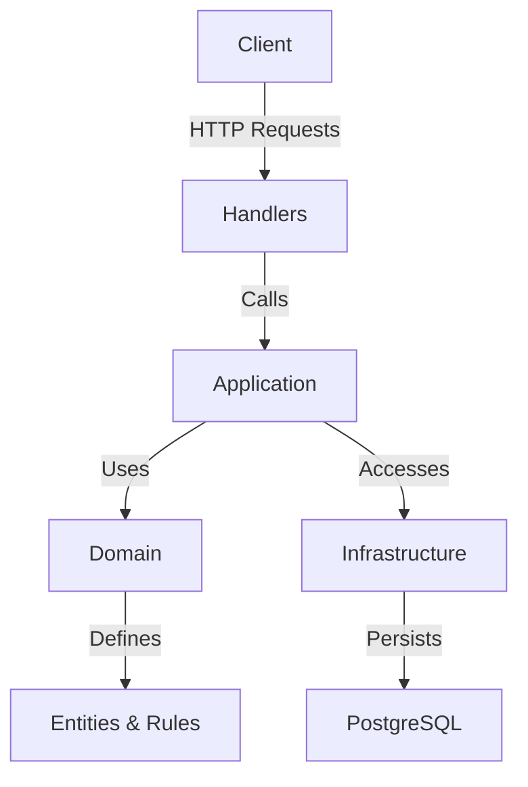

# 🌟 Domain-Driven Golang Task Manager

Welcome to the **Domain-Driven Golang Task Manager**! 🚀 This is a robust, modern Go application built with **Domain-Driven Design (DDD)** principles to manage tasks efficiently. Powered by **Gin**, **GORM**, and **PostgreSQL**, it offers a clean architecture, RESTful API, and cross-platform development support. Whether you're a developer exploring DDD or building a scalable task management system, this project is your perfect starting point! 🎉

---

## ✨ Features

- 🗂 **DDD Architecture**: Organized into `domain`, `application`, `infrastructure`, `handlers`, `routes`, `dto`, and `common` packages for maintainability and scalability.
- 📡 **RESTful API**: Create, read, update (via PATCH), and delete tasks with standardized JSON responses.
- 🔍 **Advanced Querying**: Supports **paging**, **search** by title/description, **sorting** by title/due date/created date, and **filtering** by status (Pending, Doing, Done).
- 📝 **Generalized Pagination**: Reusable pagination query and response structures in the `common` package for future extensibility.
- 🗄 **PostgreSQL Integration**: Persistent storage with GORM for seamless database operations.
- ⚙️ **Cross-Platform Development**: `Makefile` supports Windows, macOS, and Linux with automated PostgreSQL container management.
- 🔒 **Environment Configuration**: Securely manage database credentials using `.env` and `.env.example`.
- 🛠 **Extensible**: Ready for adding authentication, validation, or additional features.

---

## 🧠 What is Domain-Driven Design (DDD)?

### Overview
Domain-Driven Design (DDD) is a software design approach introduced by Eric Evans in his book *"Domain-Driven Design: Tackling Complexity in the Heart of Software"*. It focuses on aligning software development with the **business domain** by creating models that reflect real-world processes and concepts. DDD emphasizes collaboration between developers and domain experts to ensure the software solves business problems effectively. 🧩

### Core Concepts
- **Domain**: The problem space or business area the software addresses (e.g., task management in this project).
- **Entities**: Objects with unique identities (e.g., a `Task` with an ID).
- **Value Objects**: Immutable objects without identity (e.g., a task's `Status`).
- **Aggregates**: Clusters of related objects treated as a single unit (e.g., a `Task` aggregate).
- **Repositories**: Interfaces for data access, abstracting persistence (e.g., `TaskRepository`).
- **Services**: Business logic that doesn’t belong to entities or aggregates (e.g., `TaskService`).
- **Bounded Contexts**: Clear boundaries around specific domains to avoid ambiguity.

### Why Use DDD in This Project?
This project adopts DDD to create a scalable, maintainable, and business-focused task management system. Here’s why DDD is a great fit:
- **Clarity**: The `domain` package defines core business entities (`Task`) and rules, making the codebase intuitive for developers and stakeholders. 📋
- **Separation of Concerns**: Layers like `application`, `infrastructure`, and `handlers` isolate business logic from technical details, improving modularity. 🛠
- **Scalability**: DDD’s structure supports adding new features (e.g., user authentication, task categories) without disrupting existing code. 📈
- **Maintainability**: Clear boundaries and abstractions make it easier to refactor or replace components (e.g., switching from PostgreSQL to another database). 🔧

### Problems DDD Solves
- **Complex Business Logic**: By modeling the domain explicitly, DDD handles intricate task management rules (e.g., task status transitions) in a structured way.
- **Misalignment with Business Needs**: DDD ensures the software reflects the actual requirements of task management through domain-focused design.
- **Codebase Chaos**: Without DDD, business logic might mix with infrastructure code, leading to spaghetti code. DDD’s layers prevent this. 🍝
- **Team Communication**: DDD fosters a shared language (ubiquitous language) between developers and business experts, reducing misunderstandings.

### Visualization of DDD Architecture
Below is a diagram illustrating the DDD layered architecture in this project, showing how requests flow through the layers to interact with the domain and persistence.



- **Client**: Sends HTTP requests (e.g., via `curl` or a frontend).
- **Handlers**: Processes requests using Gin, validates input with `dto`.
- **Application**: Orchestrates business logic via `TaskService`.
- **Domain**: Defines core entities (`Task`) and business rules.
- **Infrastructure**: Manages persistence with GORM and PostgreSQL.
- **PostgreSQL**: Stores task data.

---

## 📂 Project Structure

The project follows DDD principles with a modular structure:

```
domain-driven-golang/
├── .env              # Environment variables (ignored by Git)
├── .env.example      # Template for .env
├── .gitignore        # Git ignore rules
├── Makefile          # Build automation
├── go.mod            # Go module dependencies
├── common/           # Common response structures
├── config/           # Database configuration
├── domain/           # Domain entities and interfaces
├── application/      # Business logic
├── infrastructure/   # Database and external services
├── handlers/         # HTTP handlers
├── routes/           # API routes
├── dto/              # Data transfer objects
└── main.go           # Application entry point
```

---

## 🛠 Tech Stack

- **Go** (1.24.3) 🐹
- **Gin** (HTTP framework) 🌐
- **GORM** (ORM for PostgreSQL) 🗃
- **PostgreSQL** (16-alpine via Docker) 🐘
- **godotenv** (Environment variable management) 🔑
- **Makefile** (Build automation) ⚒

---

## 📋 Prerequisites

Before you dive in, ensure you have the following installed:

- 🐹 **Go** (1.24.3 or later): [Download Go](https://go.dev/dl/)
- 🐳 **Docker**: [Install Docker Desktop](https://www.docker.com/products/docker-desktop/)
- ⚒ **Make**: 
  - **Windows**: Install via [Chocolatey](https://chocolatey.org/) (`choco install make`) or use Git Bash/WSL.
  - **macOS/Linux**: Usually pre-installed; verify with `make --version`.
- 📝 **Git**: [Install Git](https://git-scm.com/downloads)

---

## 🚀 Getting Started

Follow these steps to set up and run the project locally:

1. **Clone the Repository** 📥
   ```bash
   git clone https://github.com/ltphat2204/domain-driven-golang.git
   cd domain-driven-golang
   ```

2. **Initialize Go Module** 📦
   ```bash
   go mod init github.com/ltphat2204/domain-driven-golang
   go mod tidy
   ```

3. **Set Up Environment Variables** 🔑
   - Copy the example environment file:
     ```bash
     cp .env.example .env
     ```
   - The `.env` file is automatically updated by the `Makefile` when starting PostgreSQL, but you can manually edit it if needed:
     ```env
     DB_HOST=localhost
     DB_USER=postgres
     DB_PASSWORD=12345
     DB_NAME=tasks_db
     DB_PORT=5432
     ```

4. **Run the Application** 🚀
   - Use the `Makefile` to start PostgreSQL and the Go app:
     ```bash
     make run
     ```
   - This command:
     - Starts a PostgreSQL 16-alpine container (if not already running).
     - Updates `.env` with database credentials.
     - Runs the Go application on `http://localhost:8080`.

5. **Verify the API** 🌐
   - Test the `POST /tasks` endpoint:
     ```bash
     curl -X POST http://localhost:8080/tasks -H "Content-Type: application/json" -d '{"title":"Buy groceries","description":"Milk, eggs, bread"}'
     ```
   - Expected response:
     ```json
     {
         "success": true,
         "data": {
             "ID": 1,
             "Title": "Buy groceries",
             "Description": "Milk, eggs, bread",
             "Status": "pending",
             "CreatedAt": "2025-06-14T02:21:00Z"
         }
     }
     ```

---

## 📚 API Endpoints

The API follows RESTful conventions with normalized JSON responses. Below are the available endpoints:

| Method | Endpoint          | Description                     | Query Parameters / Payload                            |
|--------|-------------------|---------------------------------|------------------------------------------------------|
| `POST` | `/tasks`          | Create a new task               | `{"title":"Task 1","description":"Details","due_at":"2025-06-15T12:00:00Z"}` |
| `GET`  | `/tasks/:id`      | Get a task by ID                | -                                                    |
| `GET`  | `/tasks`          | Get tasks with pagination, search, sort, and filter | `page`, `page_size`, `search`, `sort_by`, `sort_order`, `status` |
| `PATCH`| `/tasks/:id`      | Partially update a task         | `{"status":"Done"}`                                  |
| `DELETE` | `/tasks/:id`    | Delete a task                   | -                                                    |

### GET /tasks Query Parameters
| Parameter    | Description                              | Example Values                     | Default          |
|--------------|------------------------------------------|------------------------------------|------------------|
| `page`       | Page number                              | `1`, `2`                          | `1`              |
| `page_size`  | Tasks per page                           | `10`, `20`                        | `10`             |
| `search`     | Keyword to search in title/description   | `groceries`                       | -                |
| `sort_by`    | Field to sort by                         | `title`, `due_at`, `created_at`   | `created_at`     |
| `sort_order` | Sort direction                           | `asc`, `desc`                     | `desc`           |
| `status`     | Filter by task status                    | `Pending`, `Doing`, `Done`        | -                |

### Example Requests
- **Create Task**:
  ```bash
  curl -X POST http://localhost:8080/tasks -H "Content-Type: application/json" -d '{"title":"Buy groceries","description":"Milk, eggs, bread","due_at":"2025-06-15T12:00:00Z"}'
  ```
- **Get Tasks with Query**:
  ```bash
  curl "http://localhost:8080/tasks?page=1&page_size=10&search=groceries&sort_by=title&sort_order=asc&status=Pending"
  ```
- **Example Response**:
  ```json
  {
      "success": true,
      "data": {
          "tasks": [
              {
                  "ID": 1,
                  "Title": "Buy groceries",
                  "Description": "Milk, eggs, bread",
                  "Status": "Pending",
                  "CreatedAt": "2025-06-14T15:03:00Z",
                  "UpdatedAt": "2025-06-14T15:03:00Z",
                  "DueAt": "2025-06-15T12:00:00Z"
              }
          ],
          "meta": {
              "total": 1,
              "page": 1,
              "page_size": 10,
              "total_pages": 1
          }
      }
  }
  ```
- **Update Task (PATCH)**:
  ```bash
  curl -X PATCH http://localhost:8080/tasks/1 -H "Content-Type: application/json" -d '{"status":"Done"}'
  ```
- **Delete Task**:
  ```bash
  curl -X DELETE http://localhost:8080/tasks/1
  ```

---

## 🛠 Makefile Commands

The `Makefile` simplifies development tasks and is cross-platform (Windows, macOS, Linux). Run `make help` to see all commands:

```bash
make help
```

| Command          | Description                                      |
|------------------|--------------------------------------------------|
| `make run`       | Start PostgreSQL and run the Go app             |
| `make build`     | Build the executable (`bin/domain-driven-golang`) |
| `make test`      | Run Go tests                                    |
| `make postgres`  | Start the PostgreSQL container                  |
| `make postgres-stop` | Stop and remove the PostgreSQL container    |
| `make clean`     | Stop PostgreSQL and remove build artifacts      |
| `make fmt`       | Format Go code                                  |

---

## 🐳 PostgreSQL Setup

The project uses a PostgreSQL 16-alpine container managed via Docker. The `Makefile` automates its setup:

- **Container Name**: `domain-driven-golang-postgres`
- **Database**: `tasks_db`
- **User**: `postgres`
- **Password**: `12345`
- **Port**: `5432`

To interact with the database:
```bash
make postgres
docker exec -it domain-driven-golang-postgres psql -U postgres -d tasks_db
```

---

## 🤝 Contributing

Contributions are welcome! 🌟 Follow these steps:

1. Fork the repository 🍴
2. Create a feature branch (`git checkout -b feature/awesome-feature`) 🌿
3. Commit your changes (`git commit -m "Add awesome feature"`) 📝
4. Push to the branch (`git push origin feature/awesome-feature`) 🚀
5. Open a Pull Request 📬

Please ensure your code follows Go conventions and passes `make fmt` and `make test`.

---

## 📜 License

This project is licensed under the MIT License. See the [LICENSE](LICENSE) file for details.

---

## 🎉 Acknowledgements

- **Gin**: For a fast and flexible HTTP framework.
- **GORM**: For seamless ORM integration.
- **PostgreSQL**: For reliable data storage.
- **Go Community**: For awesome tools and libraries! 🐹

---

Built with ❤️ by [ltphat2204](https://github.com/ltphat2204). Happy coding! 🚀